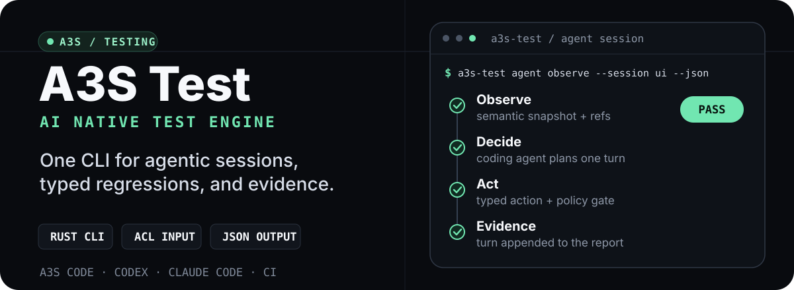
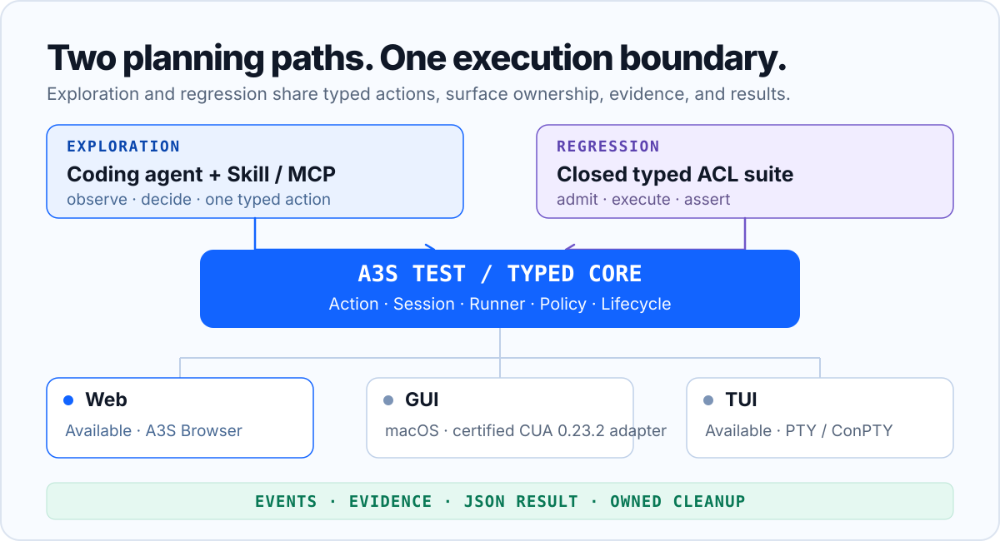

<p align="center">
  
</p>

<p align="center">
  <a href="https://github.com/A3S-Lab/Test/releases/latest"></a>
  <a href="https://github.com/A3S-Lab/Test/actions/workflows/ci.yml"></a>
  <a href="https://a3s-lab.github.io/Test/"></a>
  
  <a href="./LICENSE"></a>
</p>

<h3 align="center">Explore unknown interface paths. Preserve proven paths as typed regressions.</h3>

<p align="center">
  A3S Test gives coding agents fresh interface context, admits one typed action at a time,<br>
  and records the evidence needed to explain, reproduce, and preserve the result.
</p>

<p align="center">
  <a href="https://a3s-lab.github.io/Test/"><strong>中文文档</strong></a> ·
  <a href="https://a3s-lab.github.io/Test/en/"><strong>English</strong></a> ·
  <a href="#install">Install</a> ·
  <a href="#prove-one-real-path">Quick start</a> ·
  <a href="#embed-rendered-page-context">Test Kit</a> ·
  <a href="#architecture">Architecture</a>
</p>

## Install

The release installer downloads the matching CLI archive, verifies its
SHA-256, and installs the same portable A3S Test Skill for detected coding
agents. Run it again to upgrade both.

### macOS and Linux

```bash
curl -fsSL https://github.com/A3S-Lab/Test/releases/latest/download/install.sh | sh
```

### Windows PowerShell

```powershell
& ([scriptblock]::Create((irm 'https://github.com/A3S-Lab/Test/releases/latest/download/install.ps1')))
```

Pin a release when the test environment must be reproducible:

```bash
curl -fsSL https://github.com/A3S-Lab/Test/releases/latest/download/install.sh |
  sh -s -- --version v0.16.2
```

```powershell
& ([scriptblock]::Create((irm 'https://github.com/A3S-Lab/Test/releases/latest/download/install.ps1'))) -Version v0.16.2
```

The installers support CLI-only, Skill-only, agent-specific, and custom
installation targets. See the
[installation guide](https://a3s-lab.github.io/Test/guide/installation.html)
for every option, or download a prebuilt archive from
[Releases](https://github.com/A3S-Lab/Test/releases/latest).

## Prove one real path

Start a persistent Web session against a local product and define an
observable goal:

```bash
a3s-test agent start http://127.0.0.1:3000/checkout \
  --session checkout \
  --goal "Complete checkout with the fixture account" \
  --success "The confirmation heading is visible" \
  --json

a3s-test agent observe --session checkout --interactive --json
```

Voice-product tests can opt into a deterministic synthetic browser microphone:

```bash
a3s-test agent start http://127.0.0.1:3000/voice \
  --session voice \
  --goal "Verify the listening state" \
  --success "The listening indicator is visible" \
  --browser-microphone synthetic \
  --json
```

The microphone defaults to `disabled`. The `synthetic` profile never captures
the host microphone; it supplies Chromium's local fake media device and
permission grant, and a persistent agent session retains that profile across
turns. The same explicit option is available to `a3s-test run`, `agent run`,
and Web MCP sessions.

The observation returns a fresh generation and semantic refs instead of a
timing guess:

```text
observation_id: 1
@e1 [button] Continue
```

Bind the action to that observation, capture evidence, and finish explicitly:

```bash
a3s-test agent click @e1 \
  --session checkout \
  --observation 1 \
  --json

a3s-test agent screenshot screenshots/confirmation.png \
  --session checkout \
  --json

a3s-test agent finish \
  --session checkout \
  --status passed \
  --summary "Checkout completed and confirmation was observed" \
  --json
```

The session remains inspectable after the browser closes:

```text
.a3s-test/agent-sessions/checkout/
├── session.json
├── events.jsonl
├── report.json
└── artifacts/
    └── screenshots/confirmation.png
```

[Continue through the quick start](https://a3s-lab.github.io/Test/guide/)

## What A3S Test keeps stable

| Contract | What it prevents |
| --- | --- |
| Fresh observations | Semantic refs cannot silently cross a surface revision. |
| Typed actions | Unknown variants and fields fail before reaching a driver. |
| Scoped policy | Navigation, network, artifacts, and dispatch stay inside admitted boundaries. |
| Inspectable evidence | Events, screenshots, reports, and provenance remain machine-readable. |
| Owned cleanup | A run closes only the process tree, browser namespace, sockets, and files it created. |
| Separate authority | Browser facts, model advice, human authorization, and workspace mutation cannot impersonate one another. |

Assertions, timeouts, and ambiguously dispatched actions are never replayed
automatically. JSON fields, error codes, and process exit codes remain stable
for local runs and CI.

## Explore first, preserve second

| Workflow | Planner | Best for | Entry point |
| --- | --- | --- | --- |
| Agent session | Calling coding agent | Unknown paths, reproduction, UX review | Persistent Web CLI or GUI MCP |
| ACL suite | Closed typed manifest | Regression, CI, cross-surface checks | `check` and `run` |
| Embedded loop | Host-injected `LlmProvider` | Products embedding A3S Test | `a3s-test-agent` library |

All three paths share the same `Action`, `SurfaceDriver`, evidence, result, and
lifecycle contracts. Once an explored path is stable, preserve it as ACL:

```acl
suite "product-smoke" {
    version = 1

    scenario "home-page" {
        name = "Open the home page"
        surface = "web"
        timeout_ms = 30000

        navigate "open" {
            url = "https://example.com"
        }

        wait "loaded" {
            load = "networkidle"
        }

        expect "heading" {
            text = "Example Domain"
        }

        screenshot "evidence" {
            path = "home.png"
        }
    }
}
```

```bash
a3s-test check tests/e2e/smoke.acl --json
a3s-test run tests/e2e/smoke.acl --json
```

[Compare the workflows](https://a3s-lab.github.io/Test/guide/workflows.html)

## Embed rendered page context

Development frontends can embed `@a3s-lab/testkit` so A3S Test can read the
rendered page without relying on pixels alone:

```bash
npm install https://github.com/A3S-Lab/Test/releases/latest/download/a3s-testkit.tgz
```

```tsx
import {
  A3SReviewOverlay,
  A3STestBoundary,
  A3STestKit,
} from "@a3s-lab/testkit/react";

export function App() {
  return (
    <A3STestKit
      enabled={import.meta.env.DEV}
      page={{ id: "checkout" }}
      repairEndpoint="/__a3s-test/repairs"
      redact={["[data-payment-field]"]}
    >
      <A3STestBoundary
        id="checkout-form"
        name="Checkout form"
        source={{ file: "src/Checkout.tsx" }}
      >
        <Checkout />
      </A3STestBoundary>
      <A3SReviewOverlay enabled={import.meta.env.DEV} locale="auto" />
    </A3STestKit>
  );
}
```

After rendering, Test Kit publishes bounded, revisioned context:

- Accessible semantics, DOM and open Shadow DOM structure, and form state.
- Component identity, bounded source hints, and preferred semantic locators.
- Viewport, document, and normalized coordinates for actionable elements.
- Observed color, typography, spacing, radius, shadow, and safe design-token
  profiles with source counts and confidence.
- Flex, Grid, flow, scroll-container, and stacking relationships; exact
  client/scroll extents, signed offsets, and derived overflow/clipping state;
  resolved physical margin, border, and padding edges with box sizing, writing
  mode, and text direction; plus deterministic repeated-component clusters
  that do not guess from class names alone.
- Real default-to-hover/focus/checked/expanded state differences and bounded
  CSS, Web Animations, document/scroll/view timelines, animation ranges,
  sticky, canvas, media, and responsive evidence.
- Product facts, explicit redaction, and node/state/string/byte/time budgets.

Mutation, resize, scroll, viewport, and navigation signals advance the surface
revision. The review overlay lets a person mark one element or an ordered
batch, attach repair intent, save a draft, and explicitly send it to the
session-owning coding agent. A fresh browser run verifies admitted changes
before acceptance.

UI understanding is an additive `a3s.test.ui-understanding/1` evidence block
inside Page Context. Its observation ID binds transient computed state without
turning every animation frame or focus move into a new page revision. It does
not replace the browser accessibility tree, execute page-authored code, infer
component types from class names, or authorize an action or repair.

The review surface follows `<html lang>` by default and provides complete
English and Simplified Chinese workflow copy, including status announcements
and accessible names. Applications can pin `locale="en"` or `locale="zh-CN"`
and override known, bounded presentation messages without changing the page
context or repair protocols. Automatic mode observes live language changes;
the Layout catalog displays and searches all 90 built-in component types in
either language while leaving project-specific free-form values untouched.

The Web adapter resolves role, label, test ID, and placeholder targets across
light DOM and open Shadow DOM for click, fill, and check actions. Pointer
clicks use the target's post-scroll coordinates so host-page smooth scrolling
cannot invalidate the hit point.

[Integrate Test Kit](https://a3s-lab.github.io/Test/guide/testkit.html)

## Generate reviewed expectations

PRDs, designs, and rendered pages describe different kinds of truth:

| Source | Authoritative for | Never treated as |
| --- | --- | --- |
| PRD | Product intent, copy, outcomes, constraints | Browser-observed state |
| Design | Regions, hierarchy, geometry, image digest | Accessibility semantics |
| Page context | Rendered semantics, state, components, locators, geometry | Product intent |

A deployment-owned provider can propose cited expectations and explicit
conflicts from PRDs or design images. A person reviews those candidates before
the CLI renders a Surface Contract in ACL:

```bash
a3s-test contract generate \
  --config tests/contracts/checkout.generate.acl \
  --output tests/contracts/checkout.draft.json

a3s-test contract review \
  --draft tests/contracts/checkout.draft.json \
  --review tests/contracts/checkout.review.acl \
  --output tests/contracts/checkout.acl \
  --audit tests/contracts/checkout.reviewed.json
```

Optional visual grounding returns digest-bound point or box candidates and
never clicks. Optional design audit remains advisory and cannot set a verdict
or authorize repair.

[Read the source-to-contract workflow](https://a3s-lab.github.io/Test/guide/contracts.html)

## Surface support

| Surface | Current boundary | Backing adapter |
| --- | --- | --- |
| Web | Persistent Agent sessions and ACL suites | [A3S Browser](https://github.com/A3S-Lab/Browser) or a compatible standalone browser |
| GUI | Contract-tested and release-certified on macOS | Locked A3S CUA semantic and window-vision profiles |
| TUI | Deterministic ACL suites | Owned PTY / ConPTY process tree and bounded VT semantics |

Windows and Linux GUI combinations currently fail closed as unsupported.
Inspect available capabilities without opening a surface:

```bash
a3s-test capabilities --json
a3s-test agent schema
a3s-test provider schema design-audit
a3s-test provider schema visual-grounding
a3s-test worker inventory
```

## Architecture

<p align="center">
  
</p>

The CLI and MCP server are product boundaries, not backend selectors. Browser,
desktop perception, terminal emulation, and LLM implementations remain typed
adapters outside the framework-independent core.

<details>
<summary><strong>Workspace map</strong></summary>

```text
crates/
├── a3s-test-cli/         # Sessions, local and distributed runs, MCP, CI
├── a3s-test-core/        # Typed suites, actions, observations, contracts
├── a3s-test-runner/      # Deadlines, cancellation, retries, reports
├── a3s-test-session/     # Surface-neutral long-lived session layer
├── a3s-test-worker/      # Inventory and persistent remote worker service
├── a3s-test-driver-gui/  # Locked MCP adapter for A3S CUA
├── a3s-test-driver-tui/  # Owned PTY / ConPTY and bounded VT semantics
├── a3s-test-driver-web/  # A3S Browser / standalone browser adapter
└── a3s-test-agent/       # Providers, grounding, contracts, design audit

packages/
└── testkit/              # Rendered page context and human review SDK

skills/
└── a3s-test/             # Portable coding-agent Skill
```

</details>

[Study the architecture](https://a3s-lab.github.io/Test/concepts/architecture.html)

## Documentation

The Rspress site serves the current documentation in Chinese by default, with
an English locale and immutable historical snapshots:

- [简体中文](https://a3s-lab.github.io/Test/)
- [English](https://a3s-lab.github.io/Test/en/)
- [v0.16.2 snapshot](https://a3s-lab.github.io/Test/v0.16.2/)
- [v0.15.0 snapshot](https://a3s-lab.github.io/Test/v0.15.0/)

Repository specifications remain the source of truth for exhaustive protocol
details: [architecture](docs/architecture.md),
[agentic contract](docs/agentic.md), [ACL specification](docs/specification.md),
[Test Kit contract](docs/testkit.md),
[screen-reader audit](docs/screen-reader-audit.md),
[roadmap](docs/roadmap.md), and [changelog](CHANGELOG.md).

## Development

Run Rust gates from the repository root:

```bash
cargo +1.85.0 fmt --all -- --check
cargo +1.85.0 test --workspace --all-targets --locked
cargo +1.85.0 clippy --workspace --all-targets --locked -- -D warnings
```

Run documentation gates from `website/`:

```bash
npm ci
npm run format:check
npm run check
npm run build
npm run check:site
```

Run the production website and embedded Test Kit regression from the
repository root after installing the website, Test Kit, and admitted
`agent-browser` dependencies:

```bash
A3S_TEST_AGENT_BROWSER="$(command -v agent-browser)" \
  cargo test -p a3s-test-cli --test web_e2e \
  real_agent_browser_runs_the_website_testkit_suite \
  --locked -- --ignored --exact --nocapture
```

## License

A3S Test is available under the [MIT License](LICENSE).
