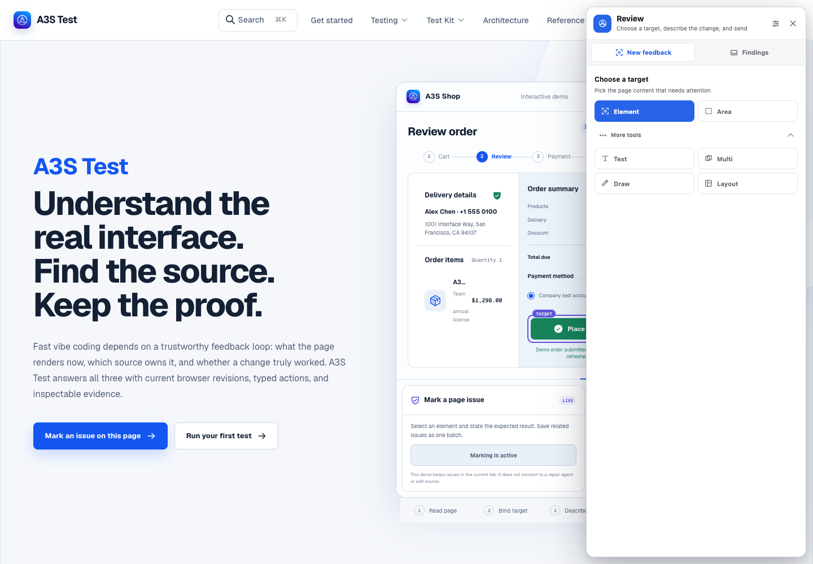

<p align="center">
  
</p>

<p align="center">
  <a href="https://github.com/A3S-Lab/Test/releases/latest"></a>
  <a href="https://github.com/A3S-Lab/Test/actions/workflows/ci.yml"></a>
  <a href="https://www.npmjs.com/package/@a3s-lab/testkit"></a>
  <a href="https://a3s-lab.github.io/Test/"></a>
  
  <a href="./LICENSE"></a>
</p>

<h3 align="center">See what actually rendered. Find the source that owns it. Prove the change.</h3>

<p align="center">
  A3S Test gives coding agents a trustworthy interface feedback loop:<br>
  fresh browser facts, revision-bound actions, source-aware review, and inspectable evidence.
</p>

<p align="center">
  <a href="https://a3s-lab.github.io/Test/"><strong>中文文档</strong></a> ·
  <a href="https://a3s-lab.github.io/Test/en/"><strong>English docs</strong></a> ·
  <a href="#install-only-what-you-need">Install</a> ·
  <a href="#run-one-real-browser-loop">Quick start</a> ·
  <a href="#add-the-page-context-test-kit">Test Kit</a> ·
  <a href="#architecture">Architecture</a>
</p>

## The product is the proof

<p align="center">
  
</p>

<p align="center"><sub>The real Test Kit package running inside the documentation site. This public demo keeps findings in the current tab; it does not connect to a repair agent or edit source.</sub></p>

A coding agent should never repair an interface it only imagines. A3S Test keeps
the path from page to regression short and checkable:

|                  | Question                              | A3S Test answer                                                                             |
| ---------------- | ------------------------------------- | ------------------------------------------------------------------------------------------- |
| **01 · Observe** | What does the page render now?        | Browser semantics plus bounded Test Kit context tied to the current page revision           |
| **02 · Locate**  | Which source owns the visible result? | Stable locator candidates, component ownership, geometry, and ranked source spans           |
| **03 · Prove**   | Did the change work without drift?    | Evidence from a newer revision, append-only session records, and deterministic ACL coverage |

Browser facts, model advice, human authorization, and workspace mutation remain
separate authorities. A source span can explain where to look; it never grants
permission to edit.

## Choose the shortest entry point

| You need to…                                         | Start with…       | You keep…                                                                           |
| ---------------------------------------------------- | ----------------- | ----------------------------------------------------------------------------------- |
| Explore an unfamiliar flow or reproduce a bug        | CLI + Agent Skill | Observations, admitted actions, screenshots, events, and a terminal report          |
| Point at a rendered issue and carry it back to code  | Web Test Kit      | Current revision, element or region, component, source candidates, and human intent |
| Repeat a path whose actions and assertions are known | ACL suite         | A deterministic local or CI regression with owned evidence                          |

Test Kit is optional for ordinary browser automation. Add it when component
ownership, source mapping, rendered geometry, visual references, or human
marking materially improves the task.

## Install only what you need

### CLI and Agent Skill

The release installer downloads the platform archive, verifies its SHA-256,
and installs the matching portable A3S Test Skill for detected coding agents.

macOS or Linux:

```bash
curl -fsSL https://github.com/A3S-Lab/Test/releases/latest/download/install.sh | sh
```

Windows PowerShell:

```powershell
& ([scriptblock]::Create((irm 'https://github.com/A3S-Lab/Test/releases/latest/download/install.ps1')))
```

Pin the current stable release when reproducibility matters:

```bash
curl -fsSL https://github.com/A3S-Lab/Test/releases/latest/download/install.sh |
  sh -s -- --version v1.0.0
```

```powershell
& ([scriptblock]::Create((irm 'https://github.com/A3S-Lab/Test/releases/latest/download/install.ps1'))) -Version v1.0.0
```

### Web Test Kit

Install the development-only React integration from npm:

```bash
npm install --save-dev @a3s-lab/testkit@0.6.2
npm ls @a3s-lab/testkit
```

`@a3s-lab/testkit` 0.6.2 is published on the official npm Registry with
GitHub OIDC provenance. Its version advances independently from the CLI.

[Open the complete installation guide](https://a3s-lab.github.io/Test/guide/installation.html)

## Run one real browser loop

Start a persistent session with a result the page can prove:

```bash
a3s-test agent start http://127.0.0.1:3000/checkout \
  --session checkout \
  --goal "Complete checkout with the fixture account" \
  --success "The confirmation heading is visible" \
  --json

a3s-test agent observe --session checkout --interactive --json
```

The observation returns fresh semantic refs bound to one observation:

```text
observation_id: 1
@e1 [button] Continue
```

Admit one action against that observation, retain the minimum evidence, and
finish explicitly:

```bash
a3s-test agent click @e1 \
  --session checkout \
  --observation 1 \
  --json

a3s-test agent screenshot screenshots/confirmation.png \
  --session checkout \
  --json

a3s-test agent finish \
  --session checkout \
  --status passed \
  --summary "Checkout completed and confirmation was observed" \
  --json
```

The browser can close; the result remains inspectable:

```text
.a3s-test/agent-sessions/checkout/
├── session.json
├── events.jsonl
├── report.json
└── artifacts/
    └── screenshots/confirmation.png
```

[Continue through the first Web test](https://a3s-lab.github.io/Test/guide/)

## Add the Page Context Test Kit

Mount two components at the application root and keep both explicitly disabled
in production:

```tsx
import { A3SReviewOverlay, A3STestKit } from "@a3s-lab/testkit/react";

const testKitEnabled = import.meta.env.DEV;

<A3STestKit enabled={testKitEnabled} page={{ id: "app" }}>
  <App />
  <A3SReviewOverlay enabled={testKitEnabled} locale="auto" />
</A3STestKit>;
```

That is enough for the default review path:

1. Open the right-side Review panel.
2. Select an element or drag over an area.
3. Describe the expected result and submit deliberately.

Text, multi-select, drawing, and Layout stay under **More tools**. The design
board slides out on the right and can hold a sketch or a crop of browser-page
content without requesting whole-screen sharing permission. The headless
Context Runtime can also run without the visible Review Overlay.

The local project loop currently on `main` validates the live
`a3s.test.testkit-handshake/1` after hydration before it reports ready. Its
`init`, `doctor`, and `dev` commands are staged after the published v1.0.0
binary.

Add an explicit source boundary only where it helps:

```tsx
import { A3STestBoundary } from "@a3s-lab/testkit/react";

<A3STestBoundary
  id="checkout-form"
  name="Checkout form"
  source={{ file: "src/Checkout.tsx" }}
>
  <Checkout />
</A3STestBoundary>;
```

Framework adapters may register an exact DOM owner and an explicitly supplied
Source Map v3. A resulting source-mapping record keeps ranked spans,
confidence, origin, and exact or ancestor relation. It is navigation evidence,
not source-edit authority.

[Read the Test Kit integration guide](https://a3s-lab.github.io/Test/guide/testkit.html)

## What makes the loop trustworthy

### Freshness before action

Every actionable ref belongs to an observation or page revision. Page changes
expire browser semantics, geometry, screenshots, and any Test Kit locator that
an exact delta cannot prove unchanged.

### Typed control before execution

Actions are closed variants. Schema, target type, driver capability, origin
policy, and session state are validated before input reaches Web, GUI, or TUI.
Unsupported behavior fails closed instead of being approximated.

### Human authority before mutation

Selecting, sketching, capturing, or saving a draft does not authorize a source
change. A finding crosses into the repair ledger only through explicit
submission; workspace mutation belongs to a separately authorized coding
agent.

### New evidence before success

A repair must prove its success against a newer rendered revision. A3S Test can
select focused project checks from trusted configuration, expand to broader
regression when observed impact demands it, and preserve the smallest proven
browser path as ACL.

[Read the authority and safety model](https://a3s-lab.github.io/Test/concepts/authority-and-safety.html)

## Preserve a proven path as ACL

Agent sessions discover unknown paths. ACL repeats only paths whose actions,
waits, and success conditions are explicit:

```acl
suite "product-smoke" {
    version = 1

    scenario "home-page" {
        name = "Open the home page"
        surface = "web"
        timeout_ms = 30000

        navigate "open" {
            url = "https://example.com"
        }

        wait "loaded" {
            load = "networkidle"
        }

        expect "heading" {
            text = "Example Domain"
            stable_for_ms = 300
            sample_interval_ms = 50
        }

        screenshot "evidence" {
            path = "home.png"
        }
    }
}
```

```bash
a3s-test check tests/e2e/smoke.acl --json
a3s-test run tests/e2e/smoke.acl --json
```

Ordinary actions are never retried implicitly. Only an explicitly sampled,
read-only assertion repeats inside its bounded stability window.

## Architecture

<p align="center">
  
</p>

| Layer                    | Responsibility                                                                                                                     |
| ------------------------ | ---------------------------------------------------------------------------------------------------------------------------------- |
| Browser + Test Kit       | Post-render semantics, page revisions, stable locator candidates, geometry, component ownership, source spans, and optional review |
| Rust Core + Session      | Typed actions, observation refs, policy, authority, persistent state, evidence, result, and lifecycle contracts                    |
| Review + Surface Drivers | Explicit repair submission plus Web, GUI, and TUI perception, dispatch, process ownership, and cleanup                             |
| Verification + ACL       | Source-bound checks, impact-driven expansion, fresh proof, and repeatable deterministic coverage                                   |

Every launched program belongs to an owned process tree. Timeouts and
cancellation reap that tree without closing unrelated developer sessions.

## Surface support

| Surface | Current boundary                                                                                 |
| ------- | ------------------------------------------------------------------------------------------------ |
| Web     | Persistent agent sessions and ACL through A3S Browser or a compatible standalone browser         |
| GUI     | macOS CUA integration certified on a real arm64 host; other desktop backends remain under review |
| TUI     | ACL suites through owned PTY / ConPTY process trees with bounded terminal semantics              |

All surfaces share Core action, policy, evidence, result, and cleanup contracts;
each adapter still owns perception and execution.

## Documentation

- [Run the first Web test](https://a3s-lab.github.io/Test/guide/)
- [Install only the parts you need](https://a3s-lab.github.io/Test/guide/installation.html)
- [Add Web Test Kit](https://a3s-lab.github.io/Test/guide/testkit.html)
- [Understand Page Context](https://a3s-lab.github.io/Test/concepts/page-context.html)
- [Compare exploration and ACL](https://a3s-lab.github.io/Test/guide/workflows.html)
- [Inspect every capability](https://a3s-lab.github.io/Test/reference/capabilities.html)

Repository-level protocol and implementation references remain in [`docs/`](docs/).

<details>
<summary><strong>Development checks</strong></summary>

Run checks from this repository, not from the parent monorepo:

```bash
cargo fmt --all -- --check
cargo test --workspace --all-targets --locked
cargo clippy --workspace --all-targets --locked -- -D warnings

npm --prefix packages/testkit test
npm --prefix website run check
npm --prefix website run build
npm --prefix website run check:site
```

</details>

## License

A3S Test and `@a3s-lab/testkit` are licensed under the [MIT License](LICENSE).
